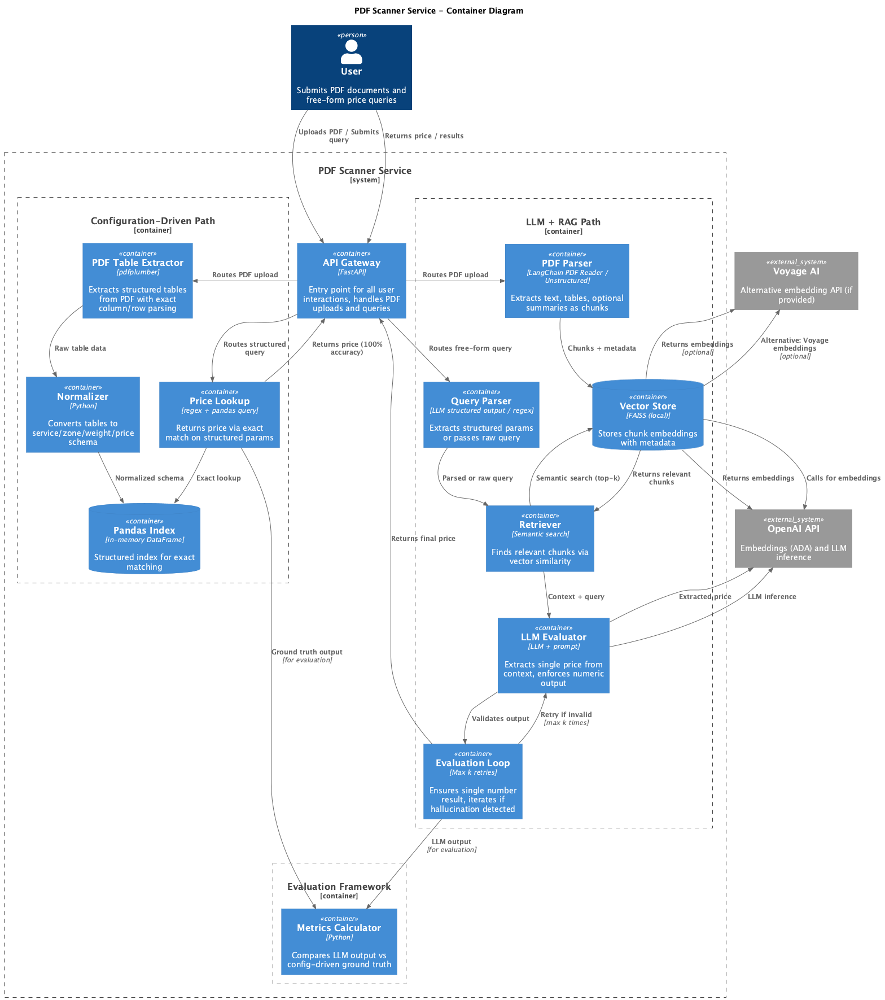

# Universal Price Lookup System - C4 Container Diagram

# Solution Architech

## Annotation

This architecture is designed for a production-ready system that can evolve over time. The solution incorporates a simple baseline (all to LLM), exact truth evaluation (configuration-driven path) and evaluation framework itself, which are essential for validating any approach before release and for measuring the impact of changes to AI and RAG frameworks.

in accurate, system itself consists of two parallel pipelines:
- **Configuration-Driven Pipeline**: Provides a baseline for backtesting and comparing different implementations. It also enables online testing during production runs to validate model performance.
- **LLM + RAG Pipeline**: The core product service that handles the primary functionality.

Additionally, an **evaluation framework** mentioned previously operates as a separate service to measure performance and quality.

> for test assigment task I am not considering any exact microservices/queue/cashes even in the 2nd container level diagram of C4, as such considerations and implementation patterns should depends also on non-func req. I do now have. Within short MVP impl of the service I would prefer to run all in 1 threaded async uvloop prob, with several containers though: Nginx + fasatAPI in Docker Compose and use local storage where needed (pdf store)

> also, regarding to the generative product feature ("Be able to process different documents using this method without code change. ") I have not covered fine-tuning approach at all. But lets keep in mem, that it should be also a result of experiment if we have resources

---

## Diagram

---

## Description

### API Gateway

To handle requests, routing, logic, serialisation

> For test assignment: nginx + fastAPI (on uvloop), no login (IAM) and so. IN production ofc could be devided splitted on more services

### 1. **Configuration-Driven Path**

Serves as the ground truth for evaluation metrics.

> Not going to create during the test assignment

- Ground truth for metrics
- Accuracy for known formats
- Fast search
- no API cost
- mb fallback for AI + RAG path if product has such non functional req/ etc.

**Components:**
1. **PDF Table Extractor** (e.g. `pdfplumber` lib)
   - Extracts structured tables from PDF documents (structured as from examples I had)
   - Works with known formats (FedEx rates, German parts catalogs)

2. **Normalizer** (Python)
   - Converts tables to a unified schema: `service / zone / weight / price` (according to examples)
   - Ensures data consistency

3. **Pandas DB** (in-memory DataFrame)
   - Structured fata for fast lookups
   - lookup with proper indexing

4. **Price Lookup** (regex + pandas query)
   - Parses queries using regex, fuzzy search, mapping (to also support some production cases if possible)
   - Performs exact matches in the DataFrame
   - Returns prices over http

---

### 2. **LLM + RAG Path**

**Goal:** Production system for handling any pdf format (structured pdf ones though)

- Production path for any format
- Handles fuzzy/semantic queries
- Iterative optimization
- Evaluated against config baseline, should beat all into LLM baseline

**Components:**

1. PDF Parser
- Extracts text, tables, and optional summaries [optional as it should be result of experiement if we need to extract raw data and then use LLM to annotate it somehow before calc embeddings]
- Divides content into chunks for embeddings
- Works with any (we could focus on structured pdf ones though) PDF format

> for test assignment prob LangChain PDF Reader could suts well.

2. Vector Store (FAISS local)
- Stores embedding chunks and metadata
- Uses different (aka experiment): e.g. OpenAI ADA or VoyageAI or qwen for embeddings (depends on costs/experiemnts other non func req)
- Provides fast semantic search (for k nearest, where k - also is experiment parameters)

> for test task - use FAISS modules from langchain

3. Query Parser (LLM structured output / regex)
- Attempts to extract structured parameters (service, zone, weight)
- with fallback strateriges if we have such product req., e.g. if unsuccessful from LLM, passes raw query to retriever

> for test assignment e.g. utilizes LangChain PydanticOutputParser

4. Retriever (Semantic search)
- Gets top-k most relevant chunks
- Uses cosine similarity on embeddings (rather then def L2, but also should be a result of experiement)
- Passes context to LLM

5. LLM Evaluator (LLM + prompt engineering)
- Receives context + user query
- Prompt with promt managment (langfuse? etc): "Extract ONLY the USD price. Return just the number."
- Calls OpenAI-like API for inference

> for test use Im going to use openAPI sdk with endponint to Pplx or OpenAI and ofc without any prompt versioning framework (rather then git though)

6. Evaluation Loop (Max k retries)
- Verifies that the answer is a single number
- If hallucination/invalid result → retry (max k times)
- Returns final price

> If needed, and the approach should come as result of experiements ofc, but just to highlight that it might give a good boost if needed within a short time

---

### 3. **Evaluation Framework** (optional metrics module)

**Goal:** Compare LLM output with ground truth

**Component:**
- **Metrics Calculator**
  - Receives outputs from both pipelines
  - Calculates: accuracy/etc, latency, cost
  - Generates reports
  - check new approaches against baseline (all into LLM) and current approaches
  - Has hidden test/validation chunks (prob prepared sintatically and extendable though)
